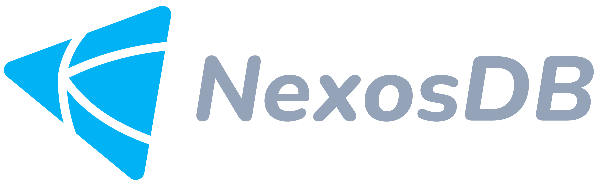

## [Website](https://nexosdb.org) | [Documentation](https://nexosdb.org/docs/latest/concepts/overview/) | [Community Chat](https://nexosdb.org/chat)

NexosDB is an embeddable lightweight and powerful key-value store designed for applications requiring fast access, strong consistency guarantees, and efficient storage utilization. NexosDB leverages the power of LSM-trees for efficient data organization and retrieval.

## Table of Contents:
  - [Key Features](#key-features)
  - [Getting Started](#getting-started)
    - [Installing](#installing)
    - [Importing NexosDB](#importing-nexosdb)
    - [Opening a database](#opening-a-database)
  - [Project Roadmap](#project-roadmap)
  - [Contributing](#contributing)
  - [License](#license)
  - [Contact](#contact)

## Key Features
**Core Operations:**
  - CRUD operations: Insert, Get, Update, Delete
  - Key-Value data model: Immutable keys, arbitrary values, TTL support

**Storage and Persistence:**
  - In-memory memtable for fast writes
  - Persistent storage with SSTables (sorted string tables)
  - Write-Ahead Log (WAL) for durability
  - Background compaction to merge SSTables and optimize storage

**Performance and Scalability:**
  - LSM-tree based storage for efficient reads and writes
  - Index structures (Bloom filters, sparse indexes) for faster lookups
  - Concurrency control for safe concurrent access
  - Atomic operations for data integrity

**Data Consistency:**
  - Strong consistency guarantees (transactions)
  - Error handling for missing keys, capacity limits, and other failures.

## Getting Started

### Installing
To start using NexosDB, install Go 1.23 or above.

NexosDB needs go modules. From your project, run the following command
```sh
$ go get github.com/imariom/nexosdb
```
This will retrieve the library.

### Importing NexosDB
To use NexosDB as an embedded key-value store, import as:

```Go
import nexos "github.com/imariom/nexosdb"

db, err := nexos.Open("my.db", 0600, nexos.options{})
if err != nil {
  return err
}
defer db.Close()
```

### Opening a database
The top-level object in NexosDB is a DB. It is represented as a single file on your disk and represents a consistent snapshot of your data.

To open your database, simply use the nexus.Open() function:

```Go
package main

import (
	"log"

	nexos "github.com/imariom/nexos"
)

func main() {
	// Open the my.db data file in your current directory.
	// It will be created if it doesn't exist.
	db, err := nexos.Open("my.db", 0600, nexos.options{})
	if err != nil {
		log.Fatal(err)
	}
	defer db.Close()

	...
}
```

## Project Roadmap

NexosDB is actively under development, with a focus on continuous improvement and expansion of functionalities. Here's a glimpse into the upcoming roadmap:

- **Phase 1: Feature Enhancements (Next 3 Months)**
  - Implement sharding and replication for horizontal scalability and fault tolerance.
  - Introduce full-text search capabilities for efficient data retrieval based on text content.
  - Explore in-memory caching options for further performance optimization.
  
- **Phase 2: Advanced Use Cases and Integrations (Next 6 Months)**
  - Investigate support for Document and Vector oriented data with specialized storage and query features.
  - Integrate with popular messaging systems for real-time data exchange.
  - Allow for user-defined data types and schema flexibility.

- **Phase 3: Community Building and Long-Term Vision (Ongoing)**
  - Enhance documentation and developer guides for broader adoption.
  - Foster an active community for collaboration and knowledge sharing.
  - Explore potential database-as-a-service (DBaaS) deployment options.

## Contributing
Contributions are welcome! If you'd like to collaborate, please:
1. Fork the repository.
2. Create your feature branch (`git checkout -b feature/YourFeature`).
3. Commit your changes (`git commit -m 'Add YourFeature'`).
4. Push to the branch (`git push origin feature/YourFeature`).
5. Open a Pull Request.

## License
Distributed under the MIT License. See `LICENSE` for more information.

## Contact
Mário Moiane - [connect@imariom.com](mailto:connect@imariom.com)
- Please visit my [website](https://imariom.com)
- Please use [Github issues](https://github.com/imariom/NexosDB) for filing bugs.
- Please follow me on Twitter [@__mrokok](https://x.com/__mrokok).
- LinkedIn Profile [Mário Moiane](https://www.linkedin.com/in/m%C3%A1rio-moiane-5aa424202)
